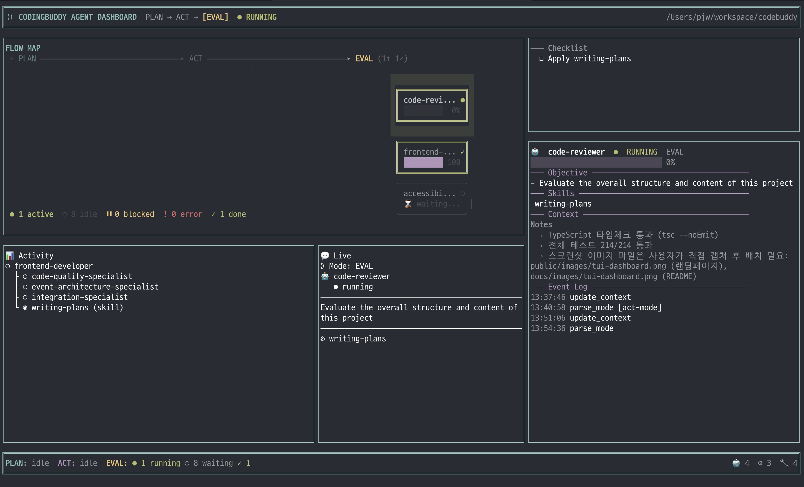

<p align="center">
  <a href="README.md">English</a> |
  <a href="README.ko.md">한국어</a> |
  <a href="README.zh-CN.md">中文</a> |
  <a href="README.ja.md">日本語</a> |
  <a href="README.es.md">Español</a>
</p>

# Codingbuddy

[](https://github.com/JeremyDev87/codingbuddy/actions/workflows/dev.yml)
[](https://www.npmjs.com/package/codingbuddy)
[](https://opensource.org/licenses/MIT)

<p align="center">
  
</p>

## AI Expert Team for Your Code

**Codingbuddy orchestrates 35 AI agents to deliver human-expert-team-level code quality.**

A single AI can't be an expert at everything. Codingbuddy creates an AI development team—architects, developers, security specialists, accessibility experts, and more—that collaborate to review, verify, and refine your code until it meets professional standards.

---

## The Vision

### The Problem

When you ask an AI to write code, you get a single perspective. No security review. No accessibility check. No architecture validation. Just one AI doing everything "okay" but nothing excellently.

Human development teams have specialists:
- **Architects** who design systems
- **Security engineers** who find vulnerabilities
- **QA specialists** who catch edge cases
- **Performance experts** who optimize bottlenecks

### Our Solution

**Codingbuddy brings the specialist team model to AI coding.**

Instead of one AI trying to do everything, Codingbuddy coordinates multiple specialized agents that collaborate:

```
┌─────────────────────────────────────────────────────────────┐
│                    Your Request                              │
│            "Implement user authentication"                   │
└─────────────────────────────────────────────────────────────┘
                            │
                            ▼
┌─────────────────────────────────────────────────────────────┐
│ 📋 PLAN: Solution Architect + Architecture Specialist       │
│          → Design system architecture                       │
│          → Define security requirements                     │
└─────────────────────────────────────────────────────────────┘
                            │
                            ▼
┌─────────────────────────────────────────────────────────────┐
│ 🚀 ACT: Backend Developer + Test Strategy Specialist        │
│         → Implement with TDD                                │
│         → Follow quality standards                          │
└─────────────────────────────────────────────────────────────┘
                            │
                            ▼
┌─────────────────────────────────────────────────────────────┐
│ 🔍 EVAL: Code Reviewer + Parallel Specialists               │
│          🔒 Security    → JWT vulnerabilities?              │
│          ♿ Accessibility → WCAG compliance?                 │
│          ⚡ Performance  → Optimization needed?              │
│          📏 Quality      → SOLID principles?                │
└─────────────────────────────────────────────────────────────┘
                            │
              ┌─────────────┴─────────────┐
              │                           │
        Critical > 0?              Critical = 0 AND
        High > 0?                  High = 0
              │                           │
              ▼                           ▼
        Return to PLAN              ✅ Quality Achieved
        with improvements           Ship with confidence
```

---

## Quick Start

**Requires Node.js 18+ and npm 9+ (or yarn 4+)**

### Claude Code Plugin (Recommended)

The fastest way to get started — full framework with harness engineering, autonomous loops, and agent collaboration:

```bash
# Install the plugin
claude plugin install codingbuddy@jeremydev87

# Install MCP server for full functionality
npm install -g codingbuddy

# Initialize your project
npx codingbuddy init
```

| Documentation | Description |
|---------------|-------------|
| [Plugin Setup Guide](docs/plugin-guide.md) | Installation and configuration |
| [Quick Reference](docs/plugin-quick-reference.md) | Commands and modes at a glance |
| [Architecture](docs/plugin-architecture.md) | How plugin and MCP work together |

### MCP Server (Other AI Tools)

For Cursor, GitHub Copilot, Antigravity, Amazon Q, Kiro, and other MCP-compatible tools:

```bash
# Initialize your project
npx codingbuddy init
```

Add to your AI tool's MCP config:

```json
{
  "mcpServers": {
    "codingbuddy": {
      "command": "npx",
      "args": ["codingbuddy", "mcp"]
    }
  }
}
```

### Start Using

```
PLAN: Implement user registration with email verification
→ AI team plans the architecture

ACT
→ AI team implements with TDD

EVAL
→ AI team reviews from 8+ perspectives

AUTO: Build a complete auth system
→ AI team iterates until quality achieved
```

[Full Getting Started Guide →](docs/getting-started.md)

---

## Multi-Agent Architecture

### 3-Tier Agent System

| Tier | Agents | Role |
|------|--------|------|
| **Mode Agents** (4) | plan-mode, act-mode, eval-mode, auto-mode | Workflow orchestration |
| **Primary Agents** (16) | solution-architect, technical-planner, frontend-developer, backend-developer, +12 more | Core implementation |
| **Specialist Agents** (15) | security, accessibility, performance, test-strategy, +11 more | Domain expertise |

### Agent Collaboration Example

When you request a feature, agents automatically collaborate:

```
🤖 solution-architect    → Designs the approach
   └── 👤 architecture-specialist  → Validates layer boundaries
   └── 👤 test-strategy-specialist → Plans test coverage

🤖 backend-developer     → Implements the code
   └── 👤 security-specialist      → Reviews auth patterns
   └── 👤 event-architecture       → Designs message flows

🤖 code-reviewer         → Evaluates quality
   └── 👤 4 specialists in parallel → Multi-dimensional review
```

---

## Quality Assurance Cycle

### The PLAN → ACT → EVAL Loop

Codingbuddy enforces a quality-driven development cycle:

1. **PLAN**: Design before coding (architecture, test strategy)
2. **ACT**: Implement with TDD and quality standards
3. **EVAL**: Multi-specialist review (security, performance, accessibility, quality)
4. **Iterate**: Continue until quality targets met

### AUTO Mode: Autonomous Quality Achievement

```bash
# Just describe what you want
AUTO: Implement JWT authentication with refresh tokens

# Codingbuddy automatically:
# → Plans the implementation
# → Writes code following TDD
# → Reviews with 4+ specialists
# → Iterates until: Critical=0 AND High=0
# → Delivers production-ready code
```

### Exit Criteria

| Severity | Must Fix Before Ship |
|----------|---------------------|
| 🔴 Critical | Yes - Immediate security/data issues |
| 🟠 High | Yes - Significant problems |
| 🟡 Medium | Optional - Technical debt |
| 🟢 Low | Optional - Enhancement |

---

## What Makes It Different

| Traditional AI Coding | Codingbuddy |
|----------------------|-------------|
| Single AI perspective | 35 specialist agent perspectives |
| "Generate and hope" | Plan → Implement → Verify |
| No quality gates | Critical=0, High=0 required |
| Manual review needed | Automated multi-dimensional review |
| Inconsistent quality | Iterative refinement until standards met |

---

## Terminal Dashboard (TUI)

Codingbuddy includes a built-in terminal UI that displays real-time agent activity, task progress, and workflow state alongside your AI assistant.

<p align="center">
  
</p>

### Quick Start

```bash
# Standalone mode (recommended) — run in a separate terminal
npx codingbuddy tui

# Embedded mode — launch alongside MCP server
npx codingbuddy mcp --tui
```

### Dashboard Panels

| Panel | Description |
|-------|-------------|
| **HeaderBar** | Workflow mode indicator (PLAN → ACT → EVAL), global state, and real-time clock |
| **FlowMap** | Hierarchical pipeline showing active agents, stages, and tree-structured progress |
| **FocusedAgent** | Live view of the active agent with sparkline activity chart and progress bar |
| **Checklist** | Task completion tracking synced from PLAN/ACT/EVAL context decisions |
| **Activity Chart** | Real-time horizontal bar chart of tool invocations updated as agents work |
| **StageHealth** | Cumulative session stats — agent count, skill count, tool invocations, and bottleneck detection |

### Key Capabilities

- **Multi-session**: Multiple Claude Code sessions share a single TUI window via IPC (Unix Domain Socket)
- **Responsive layout**: Adapts to terminal width — narrow (<80), medium (80-119), wide (120+) columns
- **Zero overhead**: Non-blocking event emission via `setImmediate()` — <1ms impact on MCP response times
- **Auto-launch**: Optionally spawns TUI in a new terminal window automatically (`CODINGBUDDY_AUTO_TUI=true`)

[TUI Guide →](docs/tui-guide.md) · [Architecture →](docs/tui-architecture.md) · [Troubleshooting →](docs/tui-troubleshooting.md)

---

## Supported AI Tools

| Tool | Status |
|------|--------|
| Claude Code | ✅ Full MCP + Plugin |
| Cursor | ✅ Supported |
| GitHub Copilot | ✅ Supported |
| Antigravity | ✅ Supported |
| Amazon Q | ✅ Supported |
| Kiro | ✅ Supported |
| OpenCode | ✅ Supported |

[Setup Guides →](docs/supported-tools.md)

---

## Configuration

### AI Model Settings

Configure the default AI model in `codingbuddy.config.json`:

```json
{
  "ai": {
    "defaultModel": "claude-sonnet-4-20250514"
  }
}
```

| Model | Best For |
|-------|----------|
| `claude-opus-4-*` | Complex architecture, deep analysis |
| `claude-sonnet-4-*` | General development (default) |
| `claude-haiku-3-5-*` | Quick lookups (not recommended for coding) |

### Verbosity Settings

Optimize token usage with verbosity levels:

```json
{
  "verbosity": "compact"
}
```

| Level | Use Case |
|-------|----------|
| `minimal` | Maximum token savings, essential info only |
| `compact` | Balanced, reduced formatting (default) |
| `standard` | Full formatting, structured responses |
| `detailed` | Extended explanations, examples included |

---

## Documentation

| Document | Description |
|----------|-------------|
| [Getting Started](docs/getting-started.md) | Installation and quick setup |
| [Philosophy](docs/philosophy.md) | Vision and design principles |
| [Agent System](packages/rules/.ai-rules/agents/README.md) | Complete agent reference |
| [Skills Library](packages/rules/.ai-rules/skills/README.md) | Reusable workflow skills (TDD, debugging, PR, etc.) |
| [Supported Tools](docs/supported-tools.md) | AI tool integration guides |
| [Configuration](docs/config-schema.md) | Config file options |
| [API Reference](docs/api.md) | MCP server capabilities |

---

## Contributing

We welcome contributions! See [CONTRIBUTING.md](CONTRIBUTING.md) for guidelines.

## License

MIT © [Codingbuddy](https://github.com/JeremyDev87/codingbuddy)
