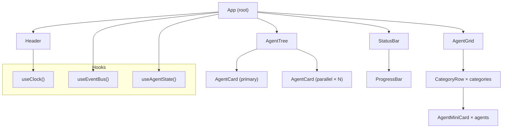
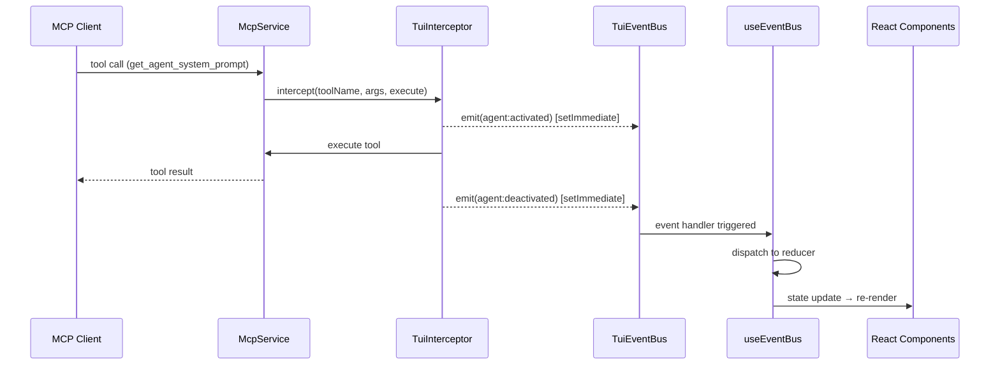
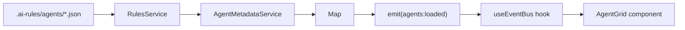
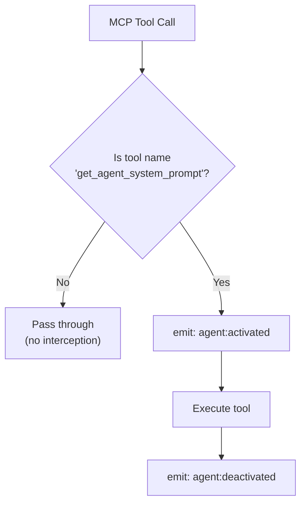
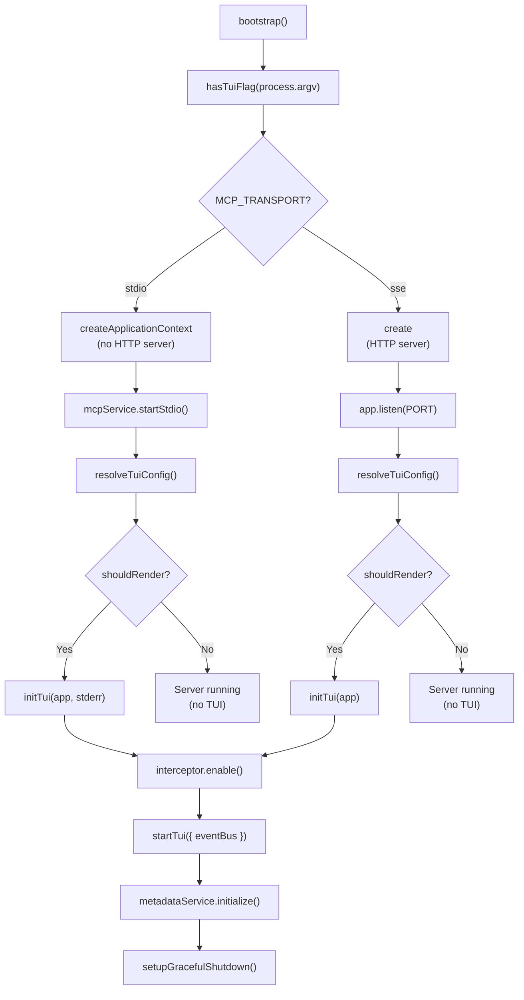

# TUI Agent Monitor Documentation Implementation Plan

> **Note:** This is the original implementation plan. The final documentation may differ from this plan. For the actual documentation, refer to `docs/tui-guide.md`, `docs/tui-architecture.md`, and `docs/tui-troubleshooting.md`.

> **For Claude:** REQUIRED SUB-SKILL: Use superpowers:executing-plans to implement this plan task-by-task.

**Goal:** Issue #351 - TUI Agent Monitor의 사용자 가이드, 아키텍처 문서, 트러블슈팅 가이드를 작성한다.

**Architecture:** 3개의 독립적인 문서 파일을 `docs/` 디렉토리에 생성한다. 기존 `docs/` 패턴(getting-started.md, customization.md 등)을 따른다. 다국어 지원은 이 이슈 범위 밖이므로 영문으로 작성하되, 코드 예시와 다이어그램을 풍부하게 포함한다.

**Tech Stack:** Markdown, Mermaid diagrams

**Reference Files (소스 코드 기반 정보):**
- `apps/mcp-server/src/main.ts` - 부트스트랩 플로우, 환경변수, 전송 모드
- `apps/mcp-server/src/tui/cli-flags.ts` - `--tui` 플래그 감지
- `apps/mcp-server/src/tui/tui-config.ts` - 전송 모드별 TUI 설정 해석
- `apps/mcp-server/src/tui/utils/icons.ts` - Nerd Font 아이콘/폴백
- `apps/mcp-server/src/tui/utils/colors.ts` - 색상 깊이 감지
- `apps/mcp-server/src/tui/events/types.ts` - 7개 핵심 이벤트
- `apps/mcp-server/src/tui/types.ts` - AgentState, AgentStatus 타입

---

### Task 1: User Guide 문서 작성

**Files:**
- Create: `docs/tui-guide.md`

**Step 1: User Guide 파일 생성**

다음 내용으로 `docs/tui-guide.md`를 생성한다:

```markdown
# TUI Agent Monitor - User Guide

The TUI (Terminal User Interface) Agent Monitor provides a real-time visual dashboard
for monitoring Codingbuddy's specialist agent execution directly in your terminal.

## Quick Start

### Running with TUI

Add the `--tui` flag when starting the MCP server:

```bash
# stdio mode (default) - TUI renders to stderr
yarn workspace codingbuddy start:dev -- --tui

# SSE mode - TUI renders to stdout
MCP_TRANSPORT=sse yarn workspace codingbuddy start:dev -- --tui
```

Without the `--tui` flag, the TUI is completely disabled with zero overhead.

### Transport Mode Behavior

| Transport | TUI Output | MCP Protocol | Requirement |
|-----------|-----------|--------------|-------------|
| **stdio** (default) | `stderr` | `stdout` (JSON-RPC) | stderr must be a TTY |
| **sse** | `stdout` | HTTP (port 3000) | None |

In **stdio mode**, the TUI renders to stderr to protect stdout for MCP JSON-RPC
communication. If stderr is not a TTY (e.g., piped to a file), the TUI will not render.

In **SSE mode**, the TUI renders to stdout since MCP communication happens over HTTP.

## Environment Variables

| Variable | Values | Default | Description |
|----------|--------|---------|-------------|
| `MCP_TRANSPORT` | `stdio` \| `sse` | `stdio` | Transport mode for MCP communication |
| `TERM_NERD_FONT` | `1`, `true`, `0`, `false` | Not set (fallback icons) | Enable Nerd Font icons for rich display |
| `TUI_HEIGHT` | number | Auto (`stdout.rows`) | Override terminal height |
| `TUI_WIDTH` | number | Auto (`stdout.columns`) | Override terminal width |
| `NO_COLOR` | any value | Not set | Disable all colors when set |
| `COLORTERM` | `24bit`, `truecolor`, `256color` | Auto-detected | Color depth hint for terminal |
| `MCP_DEBUG` | `1` | Not set | Enable debug logs to stderr |
| `PORT` | number | `3000` | HTTP port (SSE mode only) |
| `CORS_ORIGIN` | URL, `*`, comma-separated | Not set (disabled) | CORS configuration (SSE mode only) |

### Examples

```bash
# Enable Nerd Font icons
TERM_NERD_FONT=1 yarn workspace codingbuddy start:dev -- --tui

# SSE mode on custom port with CORS
MCP_TRANSPORT=sse PORT=8080 CORS_ORIGIN="http://localhost:3000" \
  yarn workspace codingbuddy start:dev -- --tui

# Debug mode (logs to stderr)
MCP_DEBUG=1 yarn workspace codingbuddy start:dev -- --tui

# Disable colors
NO_COLOR=1 yarn workspace codingbuddy start:dev -- --tui
```

## Supported Terminals

The TUI uses [Ink](https://github.com/vadimdemedes/ink) (React for CLI) and
[chalk](https://github.com/chalk/chalk) for rendering. It works in any terminal
that supports ANSI escape codes.

### Recommended Terminals (Truecolor / 24-bit)

| Terminal | Platform | Nerd Font Support |
|----------|----------|-------------------|
| **iTerm2** | macOS | Built-in or installable |
| **Warp** | macOS | Built-in |
| **Kitty** | macOS/Linux | Built-in |
| **Alacritty** | macOS/Linux/Windows | Configurable |
| **Windows Terminal** | Windows | Installable |
| **WezTerm** | Cross-platform | Built-in |
| **Hyper** | Cross-platform | Installable |

### Compatible Terminals (256-color)

| Terminal | Platform | Notes |
|----------|----------|-------|
| **Terminal.app** | macOS | Limited color depth |
| **GNOME Terminal** | Linux | Full 256-color support |
| **Konsole** | Linux | Full 256-color support |

### Minimal Support (16-color)

| Terminal | Notes |
|----------|-------|
| **xterm** | Basic colors only |
| Basic SSH sessions | Depends on client terminal |

### Not Supported

- Terminals without ANSI escape code support
- Piped/non-TTY environments (in stdio mode, stderr must be a TTY)

## Nerd Font Installation

Nerd Fonts add thousands of icons to your terminal, enabling the TUI to display
rich agent-specific icons instead of text abbreviations.

### What You See

| Setting | Agent Display | Example |
|---------|--------------|---------|
| `TERM_NERD_FONT=1` | Nerd Font icons | 󰚩 (architecture icon) |
| Not set (default) | Text fallback | `[Ar]` |

### Installation Methods

#### macOS (Homebrew)

```bash
# Install a Nerd Font (e.g., JetBrains Mono)
brew install --cask font-jetbrains-mono-nerd-font

# Other popular choices
brew install --cask font-fira-code-nerd-font
brew install --cask font-hack-nerd-font
brew install --cask font-meslo-lg-nerd-font
```

After installation, set the font in your terminal emulator's preferences.

#### Linux

```bash
# Download from https://www.nerdfonts.com/font-downloads
mkdir -p ~/.local/share/fonts
cd ~/.local/share/fonts
curl -fLO https://github.com/ryanoasis/nerd-fonts/releases/latest/download/JetBrainsMono.zip
unzip JetBrainsMono.zip
fc-cache -fv
```

#### Windows

1. Download from [nerdfonts.com](https://www.nerdfonts.com/font-downloads)
2. Extract the ZIP file
3. Right-click the `.ttf` files → "Install for all users"
4. Set the font in Windows Terminal settings

#### Verify Installation

After installing and configuring the font in your terminal:

```bash
# Test Nerd Font icon rendering
echo -e "\uf06a9"  # Should show a robot icon
```

If you see a box (□) or question mark (?), the Nerd Font is not configured correctly.

### Enable in Codingbuddy

```bash
# Temporary (current session)
TERM_NERD_FONT=1 yarn workspace codingbuddy start:dev -- --tui

# Permanent (add to shell profile)
echo 'export TERM_NERD_FONT=1' >> ~/.zshrc  # or ~/.bashrc
source ~/.zshrc
```

## UI Components Overview

The TUI displays the following sections:

```
┌──────────────────────────────────────────────┐
│ 🤖 CODINGBUDDY        [PLAN]     14:30:45   │  ← Header (mode + clock)
├──────────────────────────────────────────────┤
│ ┌─ Primary Agent ─────────────────────┐      │
│ │ 🏛️ architecture-specialist [running] │      │  ← Agent Tree
│ └─────────────────────────────────────┘      │
│   ├─ 🧪 test-strategy [running]             │    (parallel agents)
│   └─ 🔒 security [completed]                │
├──────────────────────────────────────────────┤
│ Architecture  Testing  Security  Frontend    │
│ [Ar]●  [CQ]○  [Ts]●  [Se]○  [Fe]○  ...    │  ← Agent Grid
├──────────────────────────────────────────────┤
│ Active: 3 │ Phase: Parallel │ ████░░ 60%    │  ← Status Bar
└──────────────────────────────────────────────┘
```

- **Header**: Shows app logo, current mode (PLAN/ACT/EVAL/AUTO), and live clock
- **Agent Tree**: Hierarchical view of primary + parallel agents
- **Agent Grid**: All available agents grouped by category, active ones highlighted
- **Status Bar**: Active count, execution phase, and progress bar
```

**Step 2: 파일이 올바르게 생성되었는지 확인**

Run: `cat docs/tui-guide.md | head -5`
Expected: 파일 헤더가 출력됨

**Step 3: Commit**

```bash
git add docs/tui-guide.md
git commit -m "docs: add TUI Agent Monitor user guide

- How to run with --tui flag
- Environment variable reference table
- Supported terminal list with color depth
- Nerd Font installation guide (macOS/Linux/Windows)
- UI component overview with ASCII diagram"
```

---

### Task 2: Architecture Documentation 작성

**Files:**
- Create: `docs/tui-architecture.md`

**Step 1: Architecture 문서 파일 생성**

다음 내용으로 `docs/tui-architecture.md`를 생성한다:

````markdown
# TUI Agent Monitor - Architecture

This document describes the internal architecture of the TUI Agent Monitor,
including component structure, event flow, and data collection mechanisms.

## Component Structure

### Directory Layout

```
apps/mcp-server/src/tui/
├── index.tsx                    # Entry: exports startTui()
├── app.tsx                      # Root React (Ink) component
├── cli-flags.ts                 # --tui flag detection
├── tui-config.ts                # Transport mode → render config
├── types.ts                     # Core types (AgentState, AgentStatus)
│
├── components/                  # Ink UI Components
│   ├── Header.tsx               # Logo, mode indicator, clock
│   ├── AgentCard.tsx            # Individual agent status card
│   ├── AgentTree.tsx            # Primary + parallel agent hierarchy
│   ├── AgentGrid.tsx            # Agent catalog by category
│   ├── AgentMiniCard.tsx        # Compact agent display
│   ├── CategoryRow.tsx          # Category section in grid
│   ├── ProgressBar.tsx          # Visual progress indicator
│   ├── StatusBar.tsx            # Bottom bar (counts, phase, progress)
│   └── *.pure.ts                # Pure utility functions per component
│
├── hooks/                       # React Hooks
│   ├── use-event-bus.ts         # EventBus → React state bridge
│   ├── use-agent-state.ts       # Agent filtering (active/idle/primary)
│   └── use-clock.ts             # Real-time clock (1s interval)
│
├── events/                      # Event System
│   ├── event-bus.ts             # TuiEventBus (EventEmitter2 wrapper)
│   ├── types.ts                 # 7 event interfaces + TuiEventMap
│   ├── tui-interceptor.ts       # MCP tool call interceptor
│   ├── parse-agent.ts           # Extract agent info from tool names
│   ├── agent-metadata.service.ts # Load agent catalog from rules
│   ├── agent-metadata.types.ts  # AgentMetadata, AgentCategory
│   └── events.module.ts         # NestJS module registration
│
└── utils/                       # Shared Utilities
    ├── icons.ts                 # Nerd Font icons + ASCII fallbacks
    ├── colors.ts                # Status colors + color depth detection
    └── constants.ts             # Mode color mapping
```

### Component Hierarchy



### Separation of Concerns

| Layer | Pattern | Files | Responsibility |
|-------|---------|-------|----------------|
| **Pure Functions** | `*.pure.ts` | Format, layout, filter logic | Zero side effects, easily testable |
| **React Components** | `*.tsx` | UI rendering | Consume props, no business logic |
| **React Hooks** | `use-*.ts` | State management | Bridge EventBus ↔ React |
| **NestJS Services** | `*.service.ts` | DI-managed singletons | Side effects, I/O |
| **Events** | `event-bus.ts` | Type-safe pub/sub | Decouple MCP ↔ TUI |

## Event Flow

### Core Events

The TUI uses 7 typed events for communication:

| Event | Payload | Source | Purpose |
|-------|---------|--------|---------|
| `agent:activated` | `AgentActivatedEvent` | TuiInterceptor | Agent starts executing |
| `agent:deactivated` | `AgentDeactivatedEvent` | TuiInterceptor | Agent completes/fails |
| `mode:changed` | `ModeChangedEvent` | Rules engine | PLAN→ACT→EVAL transitions |
| `skill:recommended` | `SkillRecommendedEvent` | Skill engine | Skill recommendation |
| `parallel:started` | `ParallelStartedEvent` | Parallel executor | Batch execution starts |
| `parallel:completed` | `ParallelCompletedEvent` | Parallel executor | Batch execution ends |
| `agents:loaded` | `AgentsLoadedEvent` | AgentMetadataService | Agent catalog available |

### Event Flow Diagram



### Non-Blocking Event Emission

Events are emitted via `setImmediate()` to prevent MCP response delays:

```typescript
// In TuiInterceptor
async intercept<T>(toolName, args, execute): Promise<T> {
  setImmediate(() => {
    this.eventBus.emit('agent:activated', { ... });
  });

  const result = await execute();  // Tool completes first

  setImmediate(() => {
    this.eventBus.emit('agent:deactivated', { ... });
  });

  return result;
}
```

This ensures:
- Tool execution is never delayed by TUI updates
- stdout remains clean for JSON-RPC in stdio mode
- UI updates happen asynchronously after tool completion

## Data Collection

### Agent State Management

The `useEventBus` hook manages all TUI state via a reducer:

```typescript
interface EventBusState {
  agents: AgentState[];       // Currently tracked agents
  mode: Mode | null;          // Current workflow mode
  skills: SkillRecommendedEvent[];  // Recommended skills
  allAgents: AgentMetadata[]; // Complete agent catalog
}
```

**State Transitions:**

| Event | State Change |
|-------|-------------|
| `agent:activated` | Add agent with `status: 'running'` |
| `agent:deactivated` | Update agent to `status: 'completed'` or `'failed'` |
| `mode:changed` | Update `mode` field |
| `skill:recommended` | Append to `skills` array |
| `parallel:started` | Mark agents in batch as `status: 'running'` |
| `parallel:completed` | Update batch agents to `status: 'completed'` |
| `agents:loaded` | Set `allAgents` catalog |

### Agent Metadata Collection

The `AgentMetadataService` loads agent definitions from the rules system:



Each agent has metadata including:
- `id`: Unique identifier (e.g., `architecture-specialist`)
- `name`: Display name
- `category`: Grouping (Architecture, Testing, Security, etc.)
- `expertise`: Array of skills/topics

### TUI Interceptor - Tool Call Detection

The `TuiInterceptor` monitors specific MCP tool calls:



Only `get_agent_system_prompt` calls are intercepted because this tool is
invoked when a specialist agent is activated by the rules engine.

## Bootstrap Flow



## Zero-Cost When Disabled

When `--tui` flag is not present:

1. `hasTuiFlag()` returns `false`
2. No dynamic imports of React/Ink packages
3. `TuiInterceptor` stays disabled (default)
4. No event listeners registered
5. No rendering overhead

This ensures the MCP server runs with zero TUI-related overhead in production.
````

**Step 2: 파일이 올바르게 생성되었는지 확인**

Run: `cat docs/tui-architecture.md | head -5`
Expected: 파일 헤더가 출력됨

**Step 3: Commit**

```bash
git add docs/tui-architecture.md
git commit -m "docs: add TUI Agent Monitor architecture documentation

- Component structure diagram with directory layout
- Event flow diagram (7 core events, sequence diagram)
- Data collection method (state management, metadata, interceptor)
- Bootstrap flow with transport mode resolution
- Mermaid diagrams for visual documentation"
```

---

### Task 3: Troubleshooting Guide 작성

**Files:**
- Create: `docs/tui-troubleshooting.md`

**Step 1: Troubleshooting 문서 파일 생성**

다음 내용으로 `docs/tui-troubleshooting.md`를 생성한다:

```markdown
# TUI Agent Monitor - Troubleshooting

Common issues and solutions when using the TUI Agent Monitor.

## Icons Display as Boxes or Question Marks

**Symptom:** Agent icons show as `□`, `?`, or empty squares instead of rich icons.

**Cause:** Nerd Font is not installed or not configured in your terminal.

**Solution:**

1. **Install a Nerd Font** (see [User Guide - Nerd Font Installation](./tui-guide.md#nerd-font-installation))

2. **Configure your terminal** to use the installed Nerd Font:
   - **iTerm2**: Preferences → Profiles → Text → Font → Select Nerd Font
   - **VS Code Terminal**: Settings → `terminal.integrated.fontFamily` → `'JetBrainsMono Nerd Font'`
   - **Windows Terminal**: Settings → Profile → Appearance → Font face

3. **Enable Nerd Font in Codingbuddy:**
   ```bash
   TERM_NERD_FONT=1 yarn workspace codingbuddy start:dev -- --tui
   ```

4. **Verify:** If icons still don't render, the TUI falls back to text abbreviations
   (e.g., `[Ar]` for Architecture, `[Se]` for Security). This is the default behavior
   when `TERM_NERD_FONT` is not set.

## Colors Don't Display Correctly

**Symptom:** No colors, wrong colors, or ANSI escape codes visible as raw text.

### No Colors at All

**Cause:** `NO_COLOR` environment variable is set, or terminal doesn't support ANSI.

**Solution:**
```bash
# Check if NO_COLOR is set
echo $NO_COLOR

# Unset it if present
unset NO_COLOR

# Run TUI
yarn workspace codingbuddy start:dev -- --tui
```

### Limited or Wrong Colors

**Cause:** Terminal color depth not detected correctly.

**Solution:**
```bash
# Check current COLORTERM setting
echo $COLORTERM

# Force truecolor (24-bit) for modern terminals
export COLORTERM=truecolor
yarn workspace codingbuddy start:dev -- --tui

# Or set 256-color mode
export COLORTERM=256color
```

**Color depth levels:**

| Level | Colors | `COLORTERM` | Visual Quality |
|-------|--------|-------------|----------------|
| 0 | None | N/A (`NO_COLOR` set) | No colors |
| 1 | 16 | Not set (basic) | Minimal |
| 2 | 256 | `256color` | Good |
| 3 | 16M | `truecolor` or `24bit` | Best |

### Raw ANSI Codes Visible

**Cause:** Terminal does not support ANSI escape sequences.

**Solution:**
- Switch to a modern terminal emulator (see [Supported Terminals](./tui-guide.md#supported-terminals))
- Or disable colors: `NO_COLOR=1 yarn workspace codingbuddy start:dev -- --tui`

## stdout Conflicts (stdio Mode)

**Symptom:** MCP client receives corrupted JSON, garbled output, or connection errors.

**Cause:** In stdio mode, MCP uses stdout for JSON-RPC protocol. If TUI output
leaks into stdout, it corrupts the protocol.

### How the TUI Prevents This

The TUI automatically renders to **stderr** in stdio mode:

```
stdout → MCP JSON-RPC messages (protected)
stderr → TUI rendering (if TTY available)
```

### If You Still See Conflicts

1. **Verify TUI target:**
   ```bash
   MCP_DEBUG=1 yarn workspace codingbuddy start:dev -- --tui
   # Look for: "TUI Agent Monitor started (stderr)"
   ```

2. **Check for other stdout pollution:**
   - Remove any `console.log()` calls in custom code
   - NestJS logger is disabled in stdio mode automatically
   - Debug output should use `process.stderr.write()` or `MCP_DEBUG=1`

3. **Disable TUI if conflicts persist:**
   ```bash
   # Run without --tui flag
   yarn workspace codingbuddy start:dev
   ```

### SSE Mode (No Conflict)

In SSE mode, there's no stdout conflict because MCP communicates over HTTP:

```bash
MCP_TRANSPORT=sse yarn workspace codingbuddy start:dev -- --tui
```

## TUI Not Rendering

**Symptom:** `--tui` flag is passed but no TUI appears.

### stdio Mode: stderr is Not a TTY

**Cause:** In stdio mode, stderr must be a TTY for TUI rendering. This fails when
stderr is piped or redirected.

**Diagnosis:**
```bash
MCP_DEBUG=1 yarn workspace codingbuddy start:dev -- --tui
# Look for: "stderr is not a TTY; skipping TUI render"
```

**Solution:**
- Run in a real terminal (not piped)
- Or switch to SSE mode where TUI renders to stdout:
  ```bash
  MCP_TRANSPORT=sse yarn workspace codingbuddy start:dev -- --tui
  ```

### Missing `--tui` Flag

The TUI is opt-in. Ensure you include `--tui`:

```bash
# ✗ No TUI
yarn workspace codingbuddy start:dev

# ✓ With TUI
yarn workspace codingbuddy start:dev -- --tui
```

Note the double dash (`--`) before `--tui` when using yarn workspace.

## Terminal Size Too Small

**Symptom:** Layout is broken, text wraps incorrectly, or components overlap.

### Minimum Size

The TUI is designed for terminal windows of at least **80 columns × 24 rows**.

**Check your terminal size:**
```bash
echo "Columns: $(tput cols), Rows: $(tput lines)"
```

### Solutions

1. **Resize your terminal window** to at least 80×24

2. **Override size with environment variables:**
   ```bash
   TUI_WIDTH=120 TUI_HEIGHT=40 yarn workspace codingbuddy start:dev -- --tui
   ```

3. **Use a larger font size** or switch to a smaller terminal font

4. **Reduce agent grid density** by narrowing the terminal - the grid auto-adjusts
   column count based on available width

### tmux / screen Users

If running inside tmux or screen, ensure the pane is large enough:

```bash
# tmux: resize current pane
# Ctrl+B then : then resize-pane -D 10  (increase height)
# Ctrl+B then : then resize-pane -R 20  (increase width)
```

## Graceful Shutdown Issues

**Symptom:** TUI doesn't clean up properly on exit, leaving terminal in a bad state.

### Normal Shutdown

The TUI handles `SIGINT` (Ctrl+C) and `SIGTERM` gracefully:
1. Unmounts Ink rendering
2. Closes NestJS application
3. Exits with code 0

### Terminal Left in Bad State

If the TUI doesn't shut down cleanly (e.g., `kill -9`):

```bash
# Reset terminal
reset

# Or
tput reset
```

### Force Shutdown

If the server hangs during shutdown:

```bash
# Find the process
ps aux | grep codingbuddy

# Send SIGTERM first (graceful)
kill <pid>

# If that doesn't work, SIGKILL (ungraceful)
kill -9 <pid>
reset  # Clean up terminal
```

## Debugging

### Enable Debug Logs

```bash
MCP_DEBUG=1 yarn workspace codingbuddy start:dev -- --tui
```

Debug messages are written to stderr and include:
- TUI startup status
- Transport mode detection
- Graceful shutdown events

### Check TUI Configuration

The TUI config resolution follows this logic:

| Condition | Result |
|-----------|--------|
| No `--tui` flag | TUI disabled |
| SSE + `--tui` | Render to stdout |
| stdio + `--tui` + stderr TTY | Render to stderr |
| stdio + `--tui` + stderr not TTY | TUI disabled (reason logged) |
```

**Step 2: 파일이 올바르게 생성되었는지 확인**

Run: `cat docs/tui-troubleshooting.md | head -5`
Expected: 파일 헤더가 출력됨

**Step 3: Commit**

```bash
git add docs/tui-troubleshooting.md
git commit -m "docs: add TUI Agent Monitor troubleshooting guide

- Nerd Font icon rendering issues and fixes
- Color display problems (NO_COLOR, COLORTERM)
- stdout conflicts in stdio mode
- TUI not rendering (TTY detection, missing flag)
- Terminal size requirements and overrides
- Graceful shutdown and terminal reset"
```

---

### Task 4: 문서 간 Cross-reference 및 최종 검증

**Files:**
- Modify: `docs/tui-guide.md` (footer에 관련 문서 링크 추가)
- Modify: `docs/tui-architecture.md` (footer에 관련 문서 링크 추가)
- Modify: `docs/tui-troubleshooting.md` (footer에 관련 문서 링크 추가)

**Step 1: 각 문서 하단에 관련 문서 링크 추가**

각 문서 마지막에 다음 섹션을 추가한다:

`docs/tui-guide.md` 하단:
```markdown
## Related Documentation

- [Architecture](./tui-architecture.md) - Internal component structure and event flow
- [Troubleshooting](./tui-troubleshooting.md) - Common issues and solutions
```

`docs/tui-architecture.md` 하단:
```markdown
## Related Documentation

- [User Guide](./tui-guide.md) - How to run and configure the TUI
- [Troubleshooting](./tui-troubleshooting.md) - Common issues and solutions
```

`docs/tui-troubleshooting.md` 하단:
```markdown
## Related Documentation

- [User Guide](./tui-guide.md) - How to run and configure the TUI
- [Architecture](./tui-architecture.md) - Internal component structure and event flow
```

**Step 2: Markdown 링크가 정상 동작하는지 확인**

Run: `ls docs/tui-guide.md docs/tui-architecture.md docs/tui-troubleshooting.md`
Expected: 3개 파일 모두 존재

**Step 3: Commit**

```bash
git add docs/tui-guide.md docs/tui-architecture.md docs/tui-troubleshooting.md
git commit -m "docs: add cross-references between TUI documentation files"
```

---

## Summary

| Task | 파일 | 설명 |
|------|------|------|
| Task 1 | `docs/tui-guide.md` | 사용자 가이드 (실행 방법, 환경변수, 터미널, Nerd Font) |
| Task 2 | `docs/tui-architecture.md` | 아키텍처 문서 (컴포넌트, 이벤트 플로우, 데이터 수집) |
| Task 3 | `docs/tui-troubleshooting.md` | 트러블슈팅 가이드 (아이콘, 색상, stdout, 터미널 크기) |
| Task 4 | 위 3개 파일 수정 | 문서 간 상호 참조 링크 추가 |

**총 커밋**: 4개 (Task별 1개)
