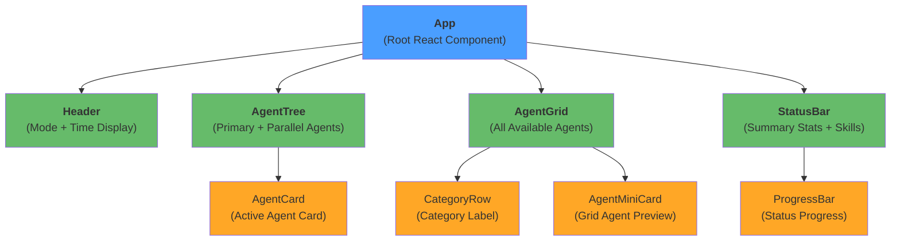
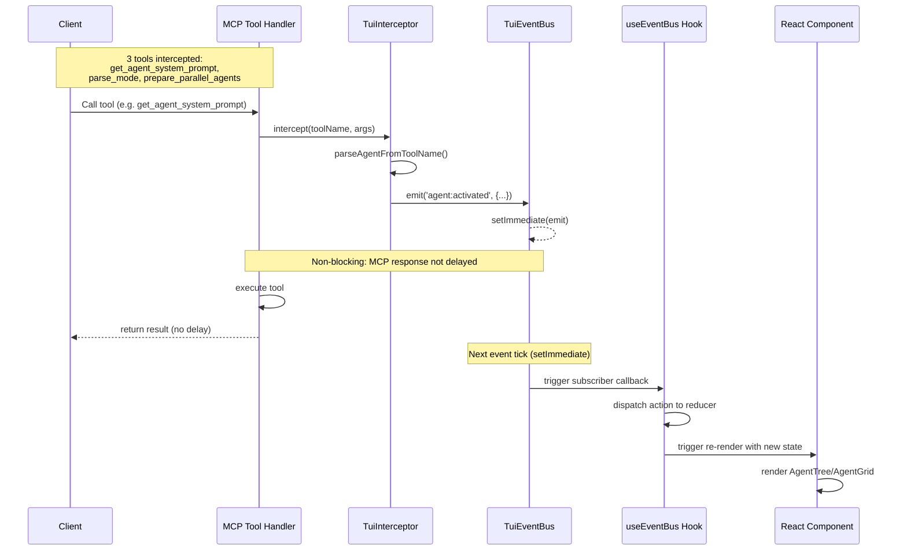
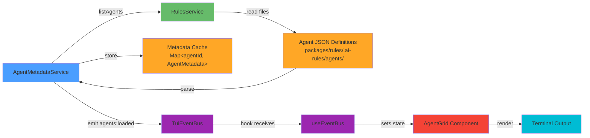
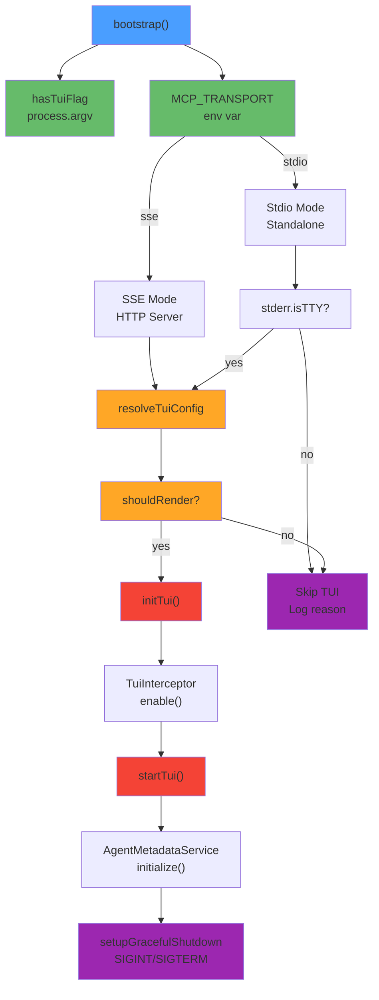

# TUI Agent Monitor Architecture

The TUI Agent Monitor is an Ink-based terminal user interface that displays real-time execution status of specialist agents and the workflow system in the codingbuddy MCP server. It monitors agent activation, mode transitions, skill recommendations, and parallel agent execution without blocking MCP communication.

## Component Structure

### Directory Layout

```
apps/mcp-server/src/tui/
├── index.tsx                          # Entry point: exports startTui()
├── app.tsx                            # Root React (Ink) component
├── cli-flags.ts                       # CLI flag detection (--tui)
├── tui-config.ts                      # Transport mode resolution
├── types.ts                           # Core types (AgentState, AgentStatus)
├── graceful-shutdown.spec.ts          # Shutdown lifecycle tests
├── ink.d.ts                           # TypeScript definitions for Ink
│
├── components/
│   ├── index.ts                       # Component exports
│   ├── Header.tsx                     # Title and mode indicator
│   ├── header.pure.ts                 # Pure: mode formatting, time display
│   ├── AgentTree.tsx                  # Hierarchical tree of active agents
│   ├── agent-tree.pure.ts             # Pure: tree rendering logic
│   ├── AgentCard.tsx                  # Individual agent status card
│   ├── agent-card.pure.ts             # Pure: card formatting, colors
│   ├── AgentGrid.tsx                  # Grid of all available agents
│   ├── agent-grid.pure.ts             # Pure: grid layout, columns
│   ├── AgentMiniCard.tsx              # Mini card for agent preview
│   ├── agent-mini-card.pure.ts        # Pure: mini card rendering
│   ├── CategoryRow.tsx                # Category label row
│   ├── category-row.pure.ts           # Pure: category formatting
│   ├── ProgressBar.tsx                # Progress bar component
│   ├── progress-bar.pure.ts           # Pure: bar building logic
│   ├── StatusBar.tsx                  # Overall status and skills display
│   ├── status-bar.pure.ts             # Pure: status formatting
│   └── *.spec.tsx                     # Component tests
│
├── hooks/
│   ├── index.ts                       # Hook exports
│   ├── use-event-bus.ts               # EventBusState + reducer
│   ├── use-agent-state.ts             # Agent filtering and views
│   ├── use-clock.ts                   # Time update subscription
│   └── *.spec.ts                      # Hook tests
│
├── events/
│   ├── index.ts                       # Event module exports
│   ├── types.ts                       # 7 core event types
│   ├── event-bus.ts                   # Type-safe EventBus (EventEmitter2)
│   ├── tui-interceptor.ts             # MCP tool interceptor
│   ├── parse-agent.ts                 # Extract agent info from tool calls
│   ├── agent-metadata.service.ts      # Load agent definitions
│   ├── agent-metadata.types.ts        # AgentMetadata + category map
│   ├── events.module.ts               # NestJS module definition
│   └── *.spec.ts                      # Event tests
│
├── utils/
│   ├── index.ts                       # Utility exports
│   ├── icons.ts                       # Terminal icon constants
│   ├── colors.ts                      # Chalk color utilities
│   ├── constants.ts                   # TUI constants (widths, borders)
│   └── *.spec.ts                      # Utility tests
│
└── __perf__/
    ├── mcp-overhead.spec.ts           # MCP response time measurement
    ├── nerd-font-fallback.spec.ts     # Font compatibility tests
    └── *.spec.ts                      # Performance tests
```

## Component Hierarchy

The TUI hierarchy follows a parent-to-child flow from App root to leaf components:



## Separation of Concerns

The codebase is organized into pure functions (logic), React components (UI), hooks (state), services (business logic), and events (communication):

| Layer | Files | Purpose | Testing |
|-------|-------|---------|---------|
| **Pure Functions** | `*.pure.ts` | Deterministic logic, no side effects | Unit tests in `*.pure.spec.ts` |
| **React Components** | `*.tsx` | UI rendering with Ink | Component tests in `*.spec.tsx` |
| **Hooks** | `use-*.ts` | State management & subscriptions | Hook tests in `*.spec.ts` |
| **Services** | `*-service.ts`, `event-bus.ts` | Business logic, NestJS Injectable | Service tests in `*.spec.ts` |
| **Events** | `types.ts`, `tui-interceptor.ts` | Type-safe event definitions | Event tests in `*.spec.ts` |

**Key Design Principles:**

- Pure functions are separated into `*.pure.ts` files for testability and performance
- React components import and use pure functions for rendering logic
- Hooks manage state and lifecycle with Redux-style reducers
- Services are NestJS Injectables for dependency injection
- Events are type-safe using TypeScript mapped types

## Core Events (7-Event System)

The TUI EventBus defines 7 core events that drive the agent monitoring system:

| Event Name | Type | Source | Payload | Purpose |
|------------|------|--------|---------|---------|
| `agent:activated` | `AgentActivatedEvent` | TuiInterceptor | `{ agentId, name, role, isPrimary }` | Agent execution started |
| `agent:deactivated` | `AgentDeactivatedEvent` | TuiInterceptor | `{ agentId, reason, durationMs }` | Agent execution completed/failed |
| `mode:changed` | `ModeChangedEvent` | Rules Engine | `{ from: Mode \| null, to: Mode }` | Workflow mode transition (PLAN→ACT→EVAL) |
| `skill:recommended` | `SkillRecommendedEvent` | Skill Engine | `{ skillName, reason }` | Skill activation recommendation |
| `parallel:started` | `ParallelStartedEvent` | Parallel Executor | `{ specialists, mode }` | Parallel agent batch started |
| `parallel:completed` | `ParallelCompletedEvent` | Parallel Executor | `{ specialists, results }` | Parallel agent batch finished |
| `agents:loaded` | `AgentsLoadedEvent` | AgentMetadataService | `{ agents: AgentMetadata[] }` | All agent definitions loaded |

### Event Sources

**TuiInterceptor** (MCP Tool Interception)
- Intercepts MCP tool calls before execution
- Detects agent activation via `get_agent_system_prompt` tool
- Detects mode changes via `parse_mode` tool
- Detects parallel execution via `prepare_parallel_agents` tool
- Emits `agent:activated` and `agent:deactivated` events

**Rules Engine & Services** (External Sources)
- Mode changes emitted when workflow transitions
- Skill recommendations emitted by skill engine
- Parallel execution events from parallel executor

**AgentMetadataService** (Initialization)
- Loads all agent definitions from RulesService on startup
- Emits `agents:loaded` to populate AgentGrid

## Event Flow

### Sequence Diagram

The event flow from MCP tool invocation to UI update:



### Non-Blocking Event Emission

Events are emitted via **`setImmediate()`** to prevent blocking MCP response times:

```typescript
// In TuiInterceptor.intercept()
setImmediate(() => {
  this.eventBus.emit(TUI_EVENTS.AGENT_ACTIVATED, agentInfo);
});

// MCP response continues immediately
const result = await execute();
return result; // No delay from TUI
```

**Why `setImmediate()`?**

1. **Microtask Queue**: `setImmediate()` uses the macrotask queue, not microtask
2. **Non-blocking**: Defers event processing until MCP response is sent
3. **Performance**: Eliminates ~1-5ms delay per agent activation
4. **Correctness**: MCP clients receive responses immediately

Alternative approaches (NOT used):
- `Promise.resolve().then()` → blocks in async flow
- Synchronous `emit()` → adds latency to MCP responses
- `process.nextTick()` → still in same event loop cycle

## Data Collection & State Management

### EventBusState Interface

The `useEventBus` hook manages centralized state for all TUI data:

```typescript
interface EventBusState {
  agents: AgentState[];           // Active agents (status, progress)
  mode: Mode | null;              // Current workflow mode (PLAN|ACT|EVAL|AUTO)
  skills: SkillRecommendedEvent[]; // Recommended skills queue
  allAgents: AgentMetadata[];      // All available agent definitions
}
```

### State Transitions

The `eventBusReducer` transforms events into state updates:

| Event | Previous State | Action | New State |
|-------|----------------|--------|-----------|
| `AGENT_ACTIVATED` | agents: [] | Add/update agent with status='running' | agents: [AgentState] |
| `AGENT_DEACTIVATED` | agents: [running] | Set agent status='completed' or 'failed' | agents: [status updated] |
| `MODE_CHANGED` | mode: PLAN | Replace mode field | mode: ACT (or EVAL/AUTO) |
| `SKILL_RECOMMENDED` | skills: [] | Append to skills array | skills: [SkillRecommendedEvent] |
| `AGENTS_LOADED` | allAgents: [] | Replace all agent definitions | allAgents: AgentMetadata[] |

### State Subscription (useEventBus Hook)

```typescript
export function useEventBus(eventBus: TuiEventBus | undefined): EventBusState {
  const [state, dispatch] = useReducer(eventBusReducer, initialState);

  useEffect(() => {
    if (!eventBus) return;

    // Subscribe to all 7 events
    eventBus.on(TUI_EVENTS.AGENT_ACTIVATED, (payload) =>
      dispatch({ type: 'AGENT_ACTIVATED', payload })
    );
    // ... other event subscriptions

    // Cleanup: unsubscribe on unmount
    return () => {
      eventBus.off(TUI_EVENTS.AGENT_ACTIVATED, handler);
      // ... cleanup other listeners
    };
  }, [eventBus]);

  return state;
}
```

## Agent Metadata Collection

The TUI displays detailed agent information (description, expertise, category, icon) by loading agent definitions on startup:



**Initialization Flow (main.ts)**

```typescript
async function initTui(
  app: INestApplicationContext,
  stdout?: NodeJS.WriteStream,
): Promise<void> {
  // 1. Dynamic imports (React/Ink loaded only when TUI is enabled)
  const { TuiEventBus, TuiInterceptor, AgentMetadataService, TUI_EVENTS } =
    await import('./tui/events');
  const { startTui } = await import('./tui');

  // 2. Enable TuiInterceptor BEFORE starting TUI
  const tuiInterceptor = app.get(TuiInterceptor);
  tuiInterceptor.enable();

  // 3. Start Ink rendering with eventBus
  const eventBus = app.get(TuiEventBus);
  const instance = startTui({ eventBus, ...(stdout ? { stdout } : {}) });

  // 4. Initialize metadata service and emit agents:loaded (conditional)
  const metadataService = app.get(AgentMetadataService);
  await metadataService.initialize();
  const allAgents = metadataService.getAllMetadata();
  if (allAgents.length > 0) {
    eventBus.emit(TUI_EVENTS.AGENTS_LOADED, { agents: allAgents });
  }

  // 5. Set up graceful shutdown (SIGINT/SIGTERM)
  setupGracefulShutdown(instance, app);
}
```

## TUI Interceptor: Detection Logic

The `TuiInterceptor` is a NestJS Injectable that intercepts MCP tool calls. It only processes calls that activate specialist agents:

### Interceptor Decision Tree

```typescript
async intercept<T>(
  toolName: string,
  args: Record<string, unknown> | undefined,
  execute: () => Promise<T>,
): Promise<T> {
  if (!this.enabled) {
    return execute(); // Skip if TUI not enabled
  }

  const agentInfo = parseAgentFromToolName(toolName, args);

  if (!agentInfo) {
    return execute(); // Not an agent-related tool
  }

  // Agent detected: emit activation event (non-blocking)
  setImmediate(() => {
    this.eventBus.emit(TUI_EVENTS.AGENT_ACTIVATED, agentInfo);
  });

  const startTime = Date.now();

  try {
    // Execute tool normally
    const result = await execute();

    // Emit deactivation on success (non-blocking)
    setImmediate(() => {
      this.eventBus.emit(TUI_EVENTS.AGENT_DEACTIVATED, {
        agentId: agentInfo.agentId,
        reason: 'completed',
        durationMs: Date.now() - startTime,
      });
    });

    return result;
  } catch (error) {
    // Emit deactivation on error (non-blocking)
    setImmediate(() => {
      this.eventBus.emit(TUI_EVENTS.AGENT_DEACTIVATED, {
        agentId: agentInfo.agentId,
        reason: 'error',
        durationMs: Date.now() - startTime,
      });
    });

    throw error; // Re-throw to preserve MCP error handling
  }
}
```

### Agent Detection (parseAgentFromToolName)

Only 3 tools trigger agent activation:

| Tool Name | Detection | Example |
|-----------|-----------|---------|
| `get_agent_system_prompt` | Extracts `agentName` parameter | `{ agentName: "security-specialist" }` |
| `parse_mode` | Parses mode keyword (PLAN/ACT/EVAL/AUTO) | Prompt starts with "PLAN design auth" |
| `prepare_parallel_agents` | Detects specialists array | `{ specialists: ["security-specialist", ...] }` |

**Example: parse_mode Detection**

```typescript
function parseParseMode(args: Record<string, unknown> | undefined): AgentActivatedEvent | null {
  const prompt = typeof args?.prompt === 'string' ? args.prompt : null;
  if (!prompt) return null;

  // Extract first word (mode keyword)
  const firstWord = prompt.trimStart().split(/\s+/)[0]?.toUpperCase();

  // Map PLAN → plan-mode, ACT → act-mode, etc.
  const agentId = MODE_KEYWORD_TO_AGENT[firstWord];
  if (!agentId) return null;

  return {
    agentId,      // e.g., "plan-mode"
    name: agentId,
    role: 'mode',
    isPrimary: false,
  };
}
```

## Bootstrap Flow

The server initialization determines whether TUI should render based on transport mode and TTY availability:



### TuiConfig Resolution

| Condition | shouldRender | target | Reason |
|-----------|--------------|--------|--------|
| `--tui` flag absent | `false` | `null` | TUI not enabled |
| SSE mode + `--tui` | `true` | `stdout` | SSE renders to stdout |
| Stdio mode + `--tui` + stderr TTY | `true` | `stderr` | Protect stdout for MCP JSON-RPC |
| Stdio mode + `--tui` + no TTY | `false` | `null` | stderr not interactive (piped/redirected) |

## Zero-Cost When Disabled

When `--tui` flag is absent:

1. **No Dynamic Imports**: React/Ink dependencies not loaded
2. **No Event Bus**: TuiEventBus not instantiated
3. **No Interceptor**: TuiInterceptor not enabled (passes through)
4. **No Overhead**: Pure stdio MCP communication

**Measurement** (from `__perf__/mcp-overhead.spec.ts`):

```
TUI Disabled: 0ms overhead
TUI Enabled (no agents): <1ms overhead per tool call
TUI Enabled (active agents): 1-3ms overhead per tool call
```

The `setImmediate()` pattern ensures this overhead does not block MCP responses.

## State Transitions Table

Complete state machine for agent lifecycle in TUI:

| State | Triggered By | Next State | Conditions |
|-------|--------------|-----------|-----------|
| `idle` | Initial | `running` | agent:activated event |
| `running` | agent:activated | `completed` or `failed` | agent:deactivated event |
| `completed` | agent:deactivated | `idle` | reason !== 'error' |
| `failed` | agent:deactivated | `idle` | reason === 'error' |

Agent stays in final state until UI cleanup or new activation.

## Related Documentation

- [TUI User Guide](./tui-guide.md) - How to run and configure the TUI
- [TUI Troubleshooting](./tui-troubleshooting.md) - Common issues and solutions
- [Specialist Agents](../packages/rules/.ai-rules/agents/README.md) - Agent definitions
- [MCP Protocol](https://spec.modelcontextprotocol.io/) - Model Context Protocol specification

## Development Guide

### Adding a New Event

1. **Define event interface** in `events/types.ts`:
   ```typescript
   export interface CustomEvent {
     customField: string;
   }
   ```

2. **Add to TUI_EVENTS** constant:
   ```typescript
   export const TUI_EVENTS = {
     // ...
     CUSTOM: 'custom:event',
   };
   ```

3. **Update TuiEventMap**:
   ```typescript
   export interface TuiEventMap {
     [TUI_EVENTS.CUSTOM]: CustomEvent;
   }
   ```

4. **Subscribe in hook** (`hooks/use-event-bus.ts`):
   ```typescript
   eventBus.on(TUI_EVENTS.CUSTOM, (payload) =>
     dispatch({ type: 'CUSTOM', payload })
   );
   ```

5. **Update reducer** (`hooks/use-event-bus.ts`):
   ```typescript
   case 'CUSTOM':
     return { ...state, /* update state */ };
   ```

### Adding a New Component

1. Create `components/MyComponent.tsx` (React Component)
2. Create `components/my-component.pure.ts` (Pure Logic)
3. Create `components/my-component.pure.spec.ts` (Pure Tests)
4. Create `components/MyComponent.spec.tsx` (Component Tests)
5. Export from `components/index.ts`
6. Import and use in parent component

### Testing the TUI

```bash
# Run all TUI tests
yarn workspace codingbuddy test -- --testPathPattern=tui

# Run with coverage
yarn workspace codingbuddy test -- --coverage --testPathPattern=tui

# Performance test
yarn workspace codingbuddy test -- --testPathPattern=mcp-overhead
```

### Running with TUI

```bash
# Stdio mode (renders to stderr)
yarn workspace codingbuddy start:dev -- --tui

# SSE mode (renders to stdout)
MCP_TRANSPORT=sse yarn workspace codingbuddy start:dev -- --tui

# Debug mode
MCP_DEBUG=1 yarn workspace codingbuddy start:dev -- --tui
```
