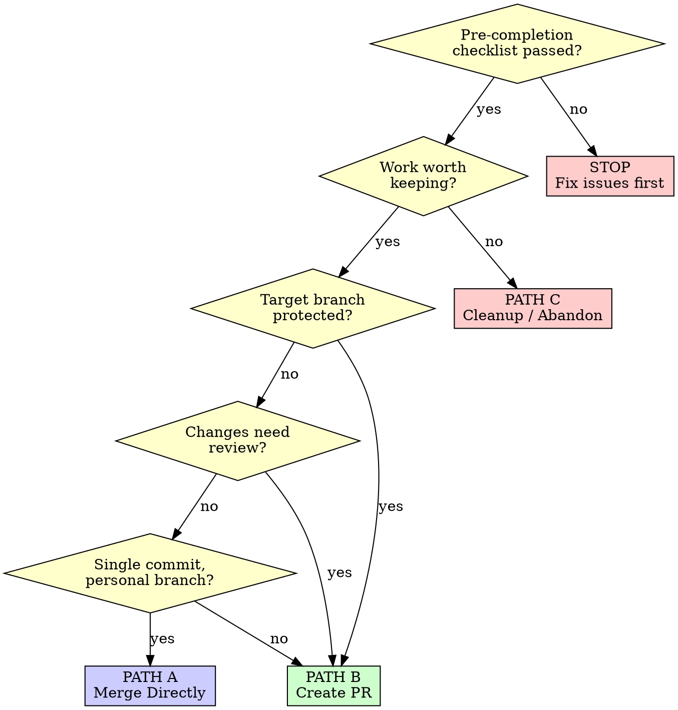

# Finishing a Development Branch

## Overview

Guide the completion of development work on a branch — decide how to integrate, verify readiness, execute the choice, and clean up.

**Core principle:** Verify before you ship. Present options, don't assume. Clean up after yourself.

## The Iron Law

```
NO MERGE WITHOUT GREEN TESTS AND CLEAN STATUS
```

If tests fail or uncommitted changes exist, STOP. Fix first. No exceptions.

**Corollary:** Never push directly to main/master. Always use a PR for protected branches.

## When to Use

- Implementation is complete on a feature branch
- All planned tasks are done (or intentionally deferred)
- Ready to integrate work back to base branch
- Need to decide: merge, PR, or abandon
- End of an executing-plans or subagent-driven-development session
- Wrapping up work in a git worktree

## When NOT to Use

- Work is still in progress (keep working)
- You haven't run tests yet (run them first)
- You're on the main/master branch (nothing to finish)

## Phase 1: Pre-Completion Checklist

**MANDATORY. Complete every item before proceeding.**

### Must Pass (blocking)

```bash
# 1. All tests pass
npm test                    # or: yarn test, pytest, go test ./...

# 2. No type errors
npx tsc --noEmit            # or equivalent for your language

# 3. No uncommitted changes
git status                  # must be clean

# 4. Branch is up to date with base
git fetch origin
git merge-base --is-ancestor origin/<base> HEAD  # exit 0 = up to date
```

- [ ] All tests pass (zero failures)
- [ ] No type errors (`tsc --noEmit` or equivalent)
- [ ] Working directory clean (`git status` shows nothing)
- [ ] No untracked files that should be committed
- [ ] Branch is up to date with base branch

### Should Check (non-blocking)

- [ ] Linting passes (eslint/prettier or equivalent)
- [ ] No TODO/FIXME left in new code
- [ ] Commits are logically grouped (not a mess of WIP)
- [ ] Commit messages follow project conventions

### Context-Dependent

- [ ] If in worktree: confirmed correct worktree
- [ ] If linked to issue: issue number in branch name or commits
- [ ] If PR already exists: PR is up to date with latest commits

**Any blocking item fails? STOP. Fix it. Re-run the checklist.**

## Phase 2: Decision Tree



### Quick Reference

| Condition | Path |
|-----------|------|
| Checklist fails | **STOP** — fix first |
| Work not worth keeping | **PATH C** — Cleanup/Abandon |
| Target branch is protected | **PATH B** — Create PR |
| Changes need review | **PATH B** — Create PR |
| Simple change, personal branch | **PATH A** — Merge Directly |
| Unsure which path | **PATH B** — Create PR (safe default) |

## Phase 3: Execute Choice

### PATH A: Merge Directly

For simple, single-commit changes on unprotected personal branches.

```bash
# 1. Update base branch
git checkout <base>
git pull origin <base>

# 2. Merge feature branch
git merge <feature-branch>

# 3. Push
git push origin <base>
```

**WARNING:** Never use PATH A if `<base>` is main/master or any protected branch. Use PATH B instead.

**When to use:** Solo work, unprotected branch, trivial change, no review needed.

**If merge conflicts arise:** Resolve conflicts, run tests again, then commit. If conflicts are complex, abort with `git merge --abort` and switch to PATH B.

### PATH B: Create PR (Recommended Default)

The safe default for most workflows. Use the `pr-all-in-one` skill if available.

```bash
# 1. Push feature branch
git push -u origin <feature-branch>

# 2. Create PR (adjust title and body as needed)
gh pr create \
  --title "feat: description of change" \
  --body "## Summary
- What changed and why

## Test plan
- [ ] Tests pass
- [ ] Manual verification done

Closes #<issue-number>"
```

**Squash before PR (if commits are messy):**
```bash
# Clean up commits (use interactive rebase for manual control,
# or --autosquash for automated fixup commits)
git rebase -i origin/<base>
# Then force-push (ALWAYS use --force-with-lease, NEVER --force)
git push --force-with-lease
```

**When to use:** Team projects, protected branches, changes needing review, anything non-trivial.

### PATH C: Cleanup / Abandon

For experimental, superseded, or failed work.

**Before abandoning, check for salvageable work:**
```bash
# Review what would be lost
git log origin/<base>..HEAD --oneline
git diff origin/<base>..HEAD --stat

# Cherry-pick specific commits if needed
git checkout <base>
git cherry-pick <commit-hash>
```

Then proceed to Phase 4 cleanup.

## Phase 4: Post-Completion Cleanup

### After Merge or PR Creation

```bash
# 1. Switch to base branch
git checkout <base>
git pull origin <base>

# 2. Delete local branch (-d is safe; use -D only if unmerged and intentional)
git branch -d <feature-branch>

# 3. Delete remote branch (if merged or abandoned)
git push origin --delete <feature-branch>
```

### If in a Git Worktree

**IMPORTANT: Remove worktree BEFORE deleting the branch.**

```bash
# 1. Leave the worktree directory
cd <main-repo-path>

# 2. Remove the worktree
git worktree remove <worktree-path>

# 3. Prune stale worktree references
git worktree prune

# 4. NOW delete the branch (-d is safe; use -D only if unmerged and intentional)
git branch -d <feature-branch>
```

**Why this order matters:** You cannot delete a branch that is checked out in a worktree. Attempting to do so will fail. Always remove the worktree first.

### Verification

```bash
# Confirm cleanup
git branch                    # feature branch should be gone
git branch -r                 # remote branch should be gone
git worktree list             # no stale worktrees
```

## Common Rationalizations

| Excuse | Reality |
|--------|---------|
| "Tests mostly pass" | Mostly ≠ all. Fix the failures. |
| "I'll clean up commits later" | Later never comes. Squash now. |
| "Direct push is faster" | Fast now, broken later. Use a PR. |
| "It's just a small change" | Small changes break things too. Follow the checklist. |
| "I'll delete the branch later" | Stale branches accumulate. Clean up now. |
| "The worktree is fine to leave" | Orphaned worktrees waste disk and cause confusion. Remove it. |
| "Force push is fine here" | Use `--force-with-lease`. Always. No exceptions. |
| "No one reviews my PRs anyway" | The PR is the review record. Create it anyway. |
| "I'll rebase after merge" | Rebase before. Conflicts after merge are worse. |

## Red Flags — STOP

- Tests failing or skipped
- Uncommitted changes in working directory
- Pushing directly to main/master
- Using `git push --force` (use `--force-with-lease`)
- Deleting a branch before removing its worktree
- Merging without updating base branch first
- Skipping the pre-completion checklist
- "Just this once" thinking

**Any red flag means: STOP. Go back to Phase 1.**

## Verification Checklist

Before marking branch work as complete:

- [ ] Pre-completion checklist passed (Phase 1)
- [ ] Decision made and executed (Phase 2 + 3)
- [ ] Local branch deleted
- [ ] Remote branch deleted (if applicable)
- [ ] Worktree removed (if applicable)
- [ ] On base branch with latest changes
- [ ] No stale worktree references

Can't check all boxes? You're not done yet.
