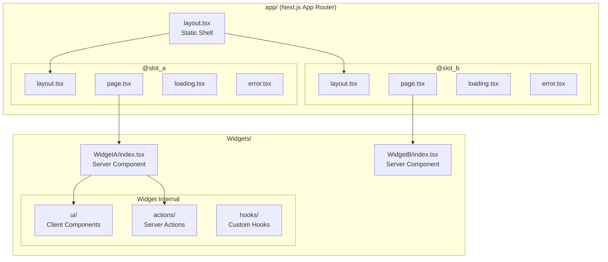
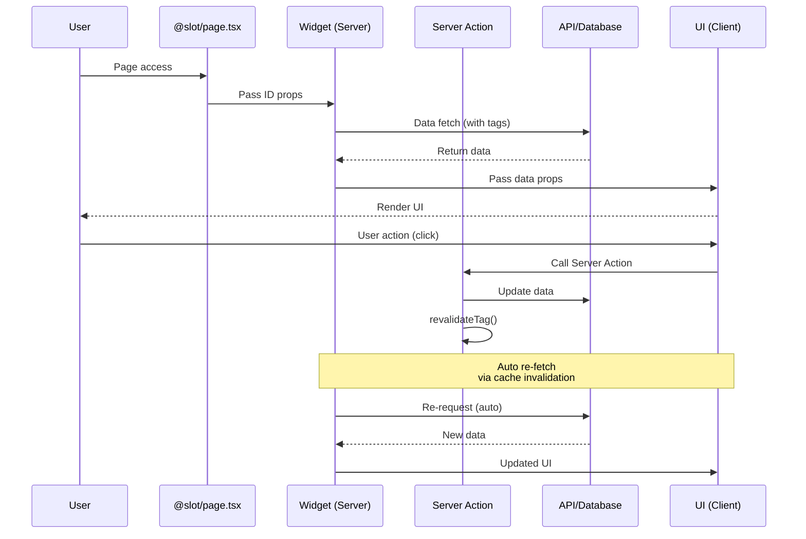
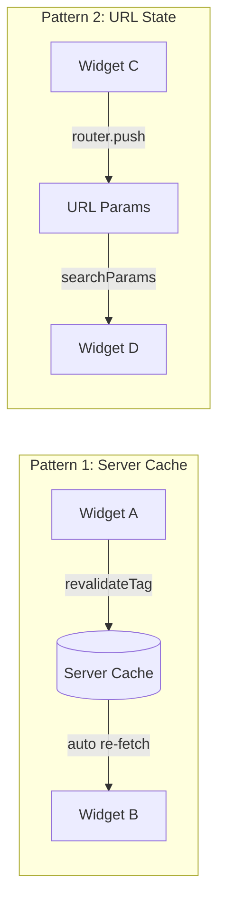

# Widget-Slot Architecture (WSA)

## Overview

Widget-Slot Architecture (WSA) is a frontend architecture pattern that leverages Next.js App Router's Parallel Routes feature to **strictly separate interaction logic from static layouts** and manage each feature as an independent widget unit.

**Core Principle:** Layouts handle structure only; logic is isolated in widgets.

**Requirements:** Next.js 13.4+ (App Router with Parallel Routes support)

## When to Use

**Use this skill:**
- Designing large-scale Next.js App Router projects
- When multiple independent dynamic regions are needed within a page
- Projects requiring team-based parallel development
- Services where feature-level fault isolation is critical
- When widget reusability and portability are required

**Not needed for:**
- Simple static pages
- Small projects (over-abstraction)
- Pages Router based projects (Parallel Routes not supported)

---

## Philosophy (5 Core Principles)

### 1. Separation of Concerns and Static Shell Maintenance
Layouts provide only the structural framework and contain no complex interactions. All dynamic elements are isolated in widgets.

### 2. Independent Self-Containment
Widgets minimize external dependencies and handle their own data. A widget should work immediately when moved to a different page's slot.

### 3. Standardized Fault Isolation
All dynamic regions (Slots) have independent Error Boundaries and Suspense. A feature's error should not cause the entire page to collapse.

### 4. Server-Centric Data Flow
Widget communication prioritizes server data cache invalidation (`revalidateTag`) or URL state over direct state sharing.

### 5. Plug & Play Development
Widgets are designed like Lego blocks. Developers have extreme freedom to 'add' new features to slots or 'remove' unnecessary ones without affecting business logic.

---

## Definitions

| Term | Definition |
|------|------------|
| **Layout** | Static structure of the service. Contains only visual elements without interactions and determines Slot positions |
| **Slot** | Dynamic region defined within a Layout. Implemented via Next.js Parallel Routes (`@slot`), managing individual loading and error states |
| **Widget** | Actual business logic unit inserted into a Slot. Includes API calls, data mutations (Actions), and user interactions (Forms, Modals, etc.) |
| **Component** | Reusable UI pieces used generically. Has no business logic or only very simple input elements |

---

## Folder Structure

```
src/
├── app/
│   ├── layout.tsx                # Overall static structure definition
│   ├── @main_slot/               # [Slot] Specific position definition
│   │   ├── layout.tsx            # Slot common wrapper (Suspense, ErrorBoundary)
│   │   ├── page.tsx              # Widget connection (calls Widgets/MyWidget)
│   │   ├── loading.tsx           # Slot-specific loading UI
│   │   ├── error.tsx             # Slot-specific error UI
│   │   └── default.tsx           # Placeholder when no data or route mismatch
│   └── (routes)/...
├── Widgets/                      # [Widget] Common widget storage (src/Widgets)
│   └── [WidgetName]/             # Widget folder by name (Colocation)
│       ├── index.tsx             # Widget Entry Point
│       ├── ui/                   # UI component folder (using barrel files)
│       ├── hooks/                # Widget-specific custom hooks
│       └── actions/              # Widget-specific Server Actions
└── Components/                   # Global common UI (Atomic Design's Atoms/Molecules level)
```

---

## Implementation Guide

### 4.1 Slot Implementation (Parallel Routes)

Slots are implemented via Parallel Routes using the `@` prefix. Each Slot directly manages its own lifecycle (Loading, Error).

**Slot Layout (Error Boundary & Suspense applied):**

```tsx
// app/@main_slot/layout.tsx
export default function MainSlotLayout({
  children
}: {
  children: React.ReactNode
}) {
  return (
    <div className="slot-container">
      {/* Next.js provided loading.tsx and error.tsx wrap children */}
      {children}
    </div>
  );
}
```

**Slot Page (Widget connection):**

```tsx
// app/@main_slot/page.tsx
import UserProfileWidget from "@/Widgets/UserProfile";

// Slot's page.tsx only performs the role of calling a single Widget
export default function MainSlotPage() {
  return <UserProfileWidget userId="current-user" />;
}
```

**Slot Loading:**

```tsx
// app/@main_slot/loading.tsx
export default function MainSlotLoading() {
  return <div className="animate-pulse">Loading...</div>;
}
```

**Slot Error:**

```tsx
// app/@main_slot/error.tsx
'use client';

export default function MainSlotError({
  error,
  reset
}: {
  error: Error;
  reset: () => void
}) {
  return (
    <div className="error-container">
      <p>Something went wrong in this section.</p>
      <button onClick={reset}>Try again</button>
    </div>
  );
}
```

**Slot Default (Fallback):**

```tsx
// app/@main_slot/default.tsx
export default function MainSlotDefault() {
  return <div>No content available</div>;
}
```

### 4.2 Widget Implementation (Colocation & Barrel Files)

Widgets are located within the `Widgets/` folder, with sub-elements organized by feature folders.

**Widget Entry Point:**

```tsx
// Widgets/UserProfile/index.tsx
import { ProfileUI } from "./ui";
import { getUserData } from "./actions";

// Widgets aim to be Server Components, calling Client Component UI internally when needed
export default async function UserProfileWidget({
  userId
}: {
  userId: string
}) {
  const userData = await getUserData(userId);

  if (!userData) {
    return <div>User not found.</div>;
  }

  return <ProfileUI data={userData} />;
}
```

**Widget UI (Client Component):**

```tsx
// Widgets/UserProfile/ui/ProfileUI.tsx
'use client';

import { User } from "../types";

interface ProfileUIProps {
  data: User;
}

export function ProfileUI({ data }: ProfileUIProps) {
  return (
    <div className="profile-card">
      <h2>{data.name}</h2>
      <p>{data.email}</p>
    </div>
  );
}
```

**Widget UI Barrel File:**

```tsx
// Widgets/UserProfile/ui/index.ts
export { ProfileUI } from "./ProfileUI";
export { ProfileSkeleton } from "./ProfileSkeleton";
```

**Widget Server Actions:**

```tsx
// Widgets/UserProfile/actions/getUserData.ts
'use server';

import { cache } from 'react';

export const getUserData = cache(async (userId: string) => {
  const res = await fetch(`/api/users/${userId}`, {
    next: { tags: [`user-${userId}`] }
  });

  if (!res.ok) return null;
  return res.json();
});
```

**Widget Folder Structure:**

```
Widgets/UserProfile/
├── index.tsx           # Widget Entry Point (Server Component)
├── types.ts            # Widget-specific types
├── ui/                 # UI Components (Client Components)
│   ├── index.ts        # Barrel file
│   ├── ProfileUI.tsx
│   └── ProfileSkeleton.tsx
├── hooks/              # Widget-specific hooks
│   └── useProfileEdit.ts
└── actions/            # Server Actions
    ├── getUserData.ts
    └── updateUserData.ts
```

### 4.3 Component Management and Promotion Rules

| Stage | Location | Criteria |
|-------|----------|----------|
| **Local Component** | Within widget/page `ui/` | Used temporarily only in specific widget |
| **Global Component** | `src/Components/` | Interaction-free UI reused across multiple places |
| **Widget Promotion** | `src/Widgets/` | When business logic is added or operates as independent functional unit |

**Promotion Triggers:**
- When data fetch is added to `src/Components/` elements
- When Server Action is needed
- When operating as independent functional unit (Form, complex Modal, etc.)

### 4.4 Combining with Intercepting Routes

Parallel Routes and Intercepting Routes can be combined to implement modal patterns. Display as modal when clicking an item from a list, display as full page when accessing URL directly.

**Folder Structure:**

```
app/
├── layout.tsx
├── @modal/                      # Parallel Route for modals
│   ├── (.)items/[id]/          # Intercept: catch same-level route
│   │   └── page.tsx            # Display as modal
│   └── default.tsx             # When no modal (return null)
├── items/
│   ├── page.tsx                # List page
│   └── [id]/
│       └── page.tsx            # Full page on direct access
└── page.tsx
```

**Root Layout (including modal slot):**

```tsx
// app/layout.tsx
export default function RootLayout({
  children,
  modal
}: {
  children: React.ReactNode;
  modal: React.ReactNode;
}) {
  return (
    <html>
      <body>
        {children}
        {modal}
      </body>
    </html>
  );
}
```

**Intercepting Route (modal display):**

```tsx
// app/@modal/(.)items/[id]/page.tsx
import ItemDetailWidget from "@/Widgets/ItemDetail";
import { Modal } from "@/Components/Modal";

export default function ItemModal({ params }: { params: { id: string } }) {
  return (
    <Modal>
      <ItemDetailWidget itemId={params.id} variant="compact" />
    </Modal>
  );
}
```

**Modal Default (when modal inactive):**

```tsx
// app/@modal/default.tsx
export default function ModalDefault() {
  return null;  // Render nothing when no modal
}
```

**Intercepting Route Rules:**

| Pattern | Description |
|---------|-------------|
| `(.)` | Intercept same-level segment |
| `(..)` | Intercept one level up segment |
| `(..)(..)` | Intercept two levels up segment |
| `(...)` | Intercept from root (`app`) |

---

## Core Rules (5 Key Rules)

### Rule 1: One Slot, One Widget
A `@slot`'s `page.tsx` should import and return **only one Widget** in principle.

```tsx
// ✅ Good
export default function SlotPage() {
  return <UserProfileWidget userId="123" />;
}

// ❌ Bad - Multiple widgets mixed
export default function SlotPage() {
  return (
    <>
      <UserProfileWidget />
      <UserSettingsWidget />
    </>
  );
}
```

### Rule 2: Data Self-Sufficiency
Widgets are recommended to **fetch required data internally**. Only receive minimal props like identifiers (IDs) from parent (Layout).

```tsx
// ✅ Good - Receive only ID, fetch data inside widget
export default async function OrderWidget({ orderId }: { orderId: string }) {
  const order = await getOrderData(orderId);
  return <OrderUI order={order} />;
}

// ❌ Bad - Parent passes data
export default function OrderWidget({ order }: { order: Order }) {
  return <OrderUI order={order} />;
}
```

### Rule 3: Minimize Communication
Avoid direct state sharing between widgets. When changing data, use **`revalidateTag`** to refresh server state or design other widgets to react via **URL Query String**.

```tsx
// ✅ Good - Cache invalidation via Server Action
'use server';
import { revalidateTag } from 'next/cache';

export async function updateUser(userId: string, data: UserInput) {
  await db.users.update(userId, data);
  revalidateTag(`user-${userId}`);  // Related widgets auto re-fetch
}

// ✅ Good - Inter-widget communication via URL state
// /dashboard?selectedUser=123
// UserListWidget changes URL → UserDetailWidget reacts via searchParams
```

### Rule 4: Ensure Default State
`default.tsx` must always be defined to return appropriate messages or Null UI so layouts don't break when there's no data.

```tsx
// app/@sidebar/default.tsx
export default function SidebarDefault() {
  return (
    <aside className="sidebar-placeholder">
      <p>Select an item to view details</p>
    </aside>
  );
}
```

### Rule 5: Widgets Must Be Portable
Widgets should work immediately without additional modifications when moved to a different page's slot.

```tsx
// app/dashboard/@profile/page.tsx
import UserProfileWidget from "@/Widgets/UserProfile";
export default function DashboardProfileSlot() {
  return <UserProfileWidget userId="current-user" />;
}

// app/admin/@profile/page.tsx - Reuse same widget in different slot
import UserProfileWidget from "@/Widgets/UserProfile";
export default function AdminProfileSlot({ params }: { params: { userId: string } }) {
  return <UserProfileWidget userId={params.userId} />;
}
```

---

## Checklist

### Design Phase
- [ ] Dynamic regions (Slots) in page identified
- [ ] Widgets corresponding to each Slot defined
- [ ] Data dependencies between Widgets analyzed
- [ ] URL state vs Server State usage decided

### Implementation Phase
- [ ] `@slot/` directory structure created (layout, page, loading, error, default)
- [ ] Widgets colocated in `Widgets/[Name]/` structure
- [ ] Widgets start as Server Components, separate Client Components when needed
- [ ] Server Actions separated in `actions/` folder
- [ ] UI components managed in `ui/` folder with barrel files

### Verification Phase
- [ ] Each Slot has independent loading/error states verified
- [ ] Widgets work when moved to different Slots verified
- [ ] One Widget's error doesn't affect other regions verified
- [ ] `default.tsx` defined for all Slots verified

---

## Testing Strategy

Widgets must be independently testable. Test Server Component Widgets and Client Component UIs separately.

### Widget Test Structure

```
Widgets/UserProfile/
├── __tests__/
│   ├── UserProfile.test.tsx      # Widget integration test
│   └── ui/
│       └── ProfileUI.test.tsx    # UI component unit test
├── index.tsx
└── ui/
    └── ProfileUI.tsx
```

### Server Component Widget Testing

Mock APIs with MSW (Mock Service Worker) and call Server Components directly.

```tsx
// Widgets/UserProfile/__tests__/UserProfile.test.tsx
import { render, screen } from '@testing-library/react';
import { setupServer } from 'msw/node';
import { http, HttpResponse } from 'msw';
import UserProfileWidget from '../index';

const server = setupServer(
  http.get('/api/users/:id', ({ params }) => {
    return HttpResponse.json({
      id: params.id,
      name: 'Test User',
      email: 'test@example.com'
    });
  })
);

beforeAll(() => server.listen());
afterEach(() => server.resetHandlers());
afterAll(() => server.close());

describe('UserProfileWidget', () => {
  it('renders user data correctly', async () => {
    // Render by directly awaiting Server Component
    const Component = await UserProfileWidget({ userId: '123' });
    render(Component);

    expect(await screen.findByText('Test User')).toBeInTheDocument();
    expect(screen.getByText('test@example.com')).toBeInTheDocument();
  });

  it('shows not found message for invalid user', async () => {
    server.use(
      http.get('/api/users/:id', () => {
        return new HttpResponse(null, { status: 404 });
      })
    );

    const Component = await UserProfileWidget({ userId: 'invalid' });
    render(Component);

    expect(screen.getByText('User not found.')).toBeInTheDocument();
  });
});
```

### Client Component UI Testing

Test UI components independently based on props.

```tsx
// Widgets/UserProfile/__tests__/ui/ProfileUI.test.tsx
import { render, screen, fireEvent } from '@testing-library/react';
import { ProfileUI } from '../../ui/ProfileUI';

describe('ProfileUI', () => {
  const mockUser = {
    id: '1',
    name: 'John Doe',
    email: 'john@example.com'
  };

  it('displays user information', () => {
    render(<ProfileUI data={mockUser} />);

    expect(screen.getByText('John Doe')).toBeInTheDocument();
    expect(screen.getByText('john@example.com')).toBeInTheDocument();
  });

  it('handles edit button click', () => {
    const onEdit = vi.fn();
    render(<ProfileUI data={mockUser} onEdit={onEdit} />);

    fireEvent.click(screen.getByRole('button', { name: /edit/i }));
    expect(onEdit).toHaveBeenCalledWith(mockUser.id);
  });
});
```

### Server Action Testing

Test Server Actions by calling them directly.

```tsx
// Widgets/UserProfile/__tests__/actions/updateUser.test.ts
import { updateUser } from '../../actions/updateUser';
import { revalidateTag } from 'next/cache';

vi.mock('next/cache', () => ({
  revalidateTag: vi.fn()
}));

describe('updateUser action', () => {
  it('updates user and revalidates cache', async () => {
    const result = await updateUser('123', { name: 'Updated Name' });

    expect(result.success).toBe(true);
    expect(revalidateTag).toHaveBeenCalledWith('user-123');
  });
});
```

### Testing Best Practices

| Practice | Description |
|----------|-------------|
| **Widget Isolation** | Each Widget must be independently testable |
| **API Mocking** | Mock API responses with MSW, no real server calls |
| **User-Centric** | Test from user perspective with Testing Library |
| **No Implementation Details** | Test behavior, not internal implementation |
| **Minimize Snapshots** | Use snapshot tests only for essential UI |

---

## Expected Benefits

| Benefit | Description |
|---------|-------------|
| **Parallelism** | Developers work on independent widgets per slot, minimizing conflicts |
| **Readability** | Page structure visible from layout files, actual logic cohesive in widget folders |
| **Flexibility** | Moving or replacing widgets is very simple when requirements change |
| **Fault Isolation** | One widget's error doesn't bring down the entire page |
| **Performance** | Independent loading possible via Parallel Routes streaming |

---

## Common Mistakes

| Mistake | Fix |
|---------|-----|
| Business logic in Layout | Move all logic to Widgets |
| Excessive props to Widget | Pass only ID, fetch data inside Widget |
| Direct state sharing | Use `revalidateTag` or URL params |
| Missing `default.tsx` | Required for all Slots |
| Multiple Widgets in one Slot | Follow one slot, one widget principle |
| Using Client Component as Widget | Prioritize Server Component, separate only UI as Client |

---

## Architecture Diagram

### Overall Structure



### Data Flow



### Inter-Widget Communication Patterns



---

## Quick Reference

```
WSA Structure
────────────────────────────────────
app/
├── layout.tsx          # Static shell (no logic)
├── @slot/
│   ├── layout.tsx      # Slot wrapper
│   ├── page.tsx        # Widget connector
│   ├── loading.tsx     # Loading UI
│   ├── error.tsx       # Error UI
│   └── default.tsx     # Fallback UI

Widgets/
└── [Name]/
    ├── index.tsx       # Entry (Server Component)
    ├── ui/             # Client Components
    ├── actions/        # Server Actions
    └── hooks/          # Custom hooks

Data Flow
────────────────────────────────────
Parent → Widget    : ID only (minimal props)
Widget → Data      : Internal fetch (self-contained)
Widget ↔ Widget    : revalidateTag / URL params
Widget → Server    : Server Actions

Key Rules
────────────────────────────────────
1. One Slot = One Widget
2. Data Self-Sufficiency
3. Minimize Direct Communication
4. Always Define default.tsx
5. Widgets Must Be Portable
```
